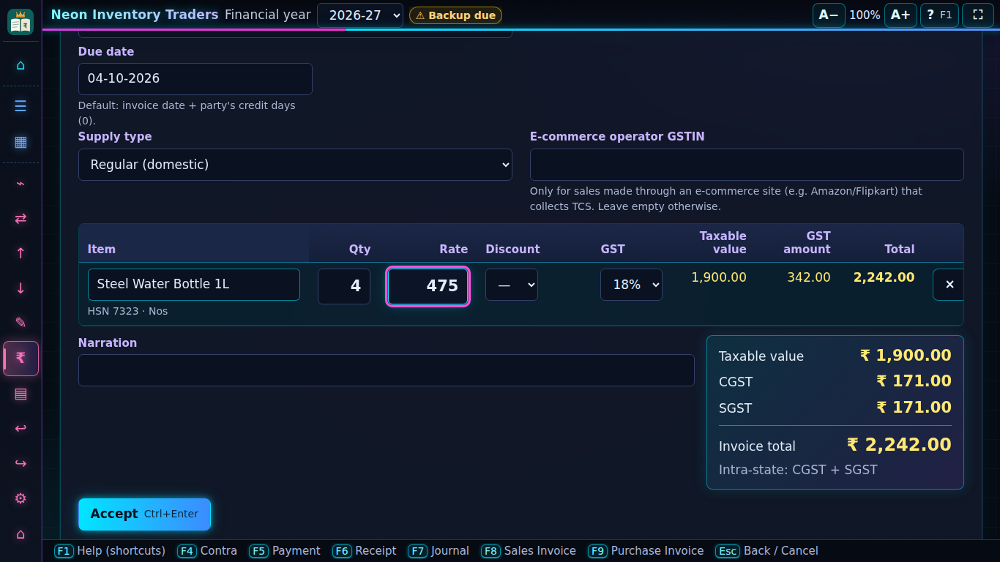
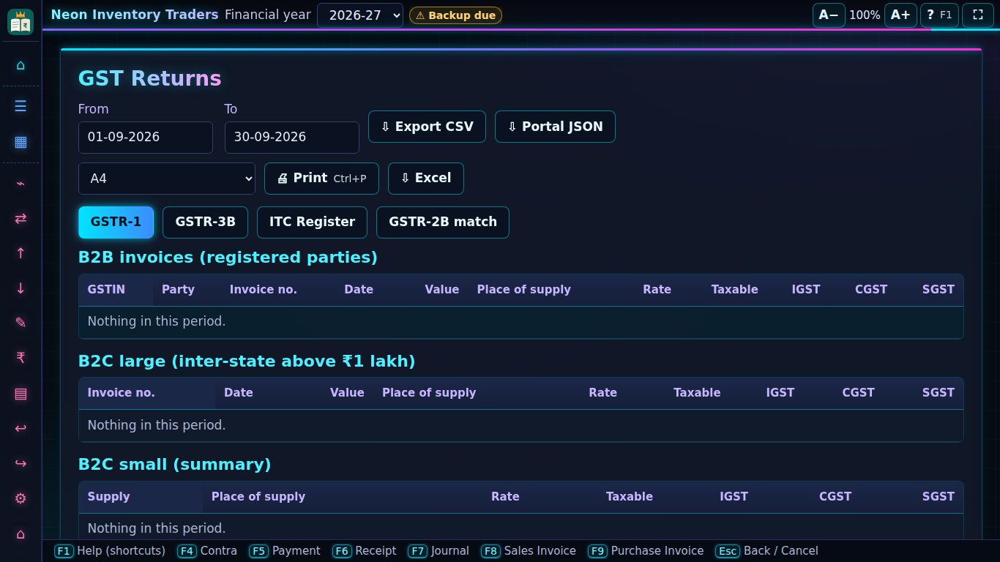
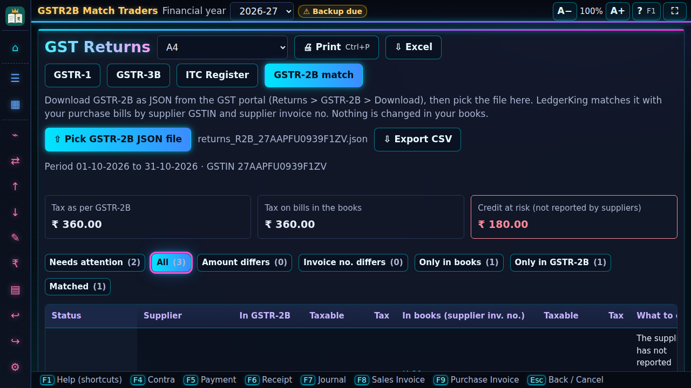
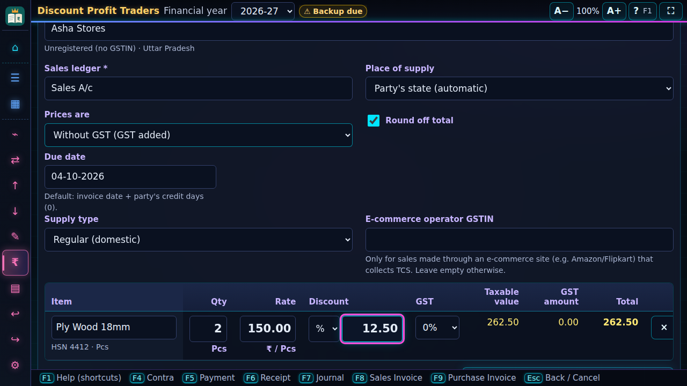
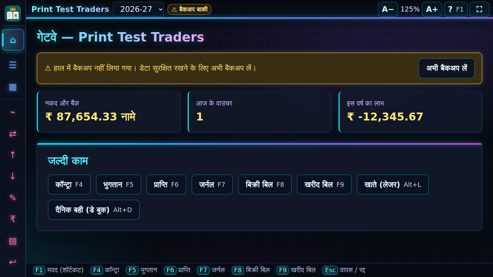

  

  <b>Accounting, GST billing and stock for Indian businesses: offline, on your own Windows PC.</b> 
  Made in India · No internet needed · 7 Indian languages · Fast like Tally

  <a href="https://www.iqkings.com/ledgerking"><b>⬇ Download free</b></a> ·
  <a href="https://www.iqkings.com/ledgerking#pricing">Plans and prices</a> ·
  <a href="FEATURES.md">All features</a> ·
  <a href="CHANGELOG.md">What's new</a>

## In short

- ✅ **GST bills in seconds**: live tax, discount, round-off, your logo, A4 or 58 / 80 mm thermal, UPI QR to get paid.
- ✅ **GST returns ready**: GSTR-1 and GSTR-3B JSON for the portal, GSTR-2B match, e-invoice and e-way bill JSON.
- ✅ **Stock that adds up**: items, units, batches, godowns, FIFO value, low-stock list, orders and challans.
- ✅ **Complete books**: Day Book, Ledger, Trial Balance, P&L, Balance Sheet, Cash Flow, Outstanding with ageing.
- ✅ **Works without internet**: your data stays on your PC; internet only for license activation and updates.
- ✅ **Free to start**: every Pro feature free for 30 days, then a Free plan for small shops, for ever.

## Who it is for

| 🏪 Shops and retail | 🚚 Traders and distributors | 🏭 Small manufacturers | 📒 Accountants and CAs |
|---|---|---|---|
| Quick bills, POS counter with barcodes, thermal print, UPI QR | Price lists 🆕, orders with part delivery, credit limits, WhatsApp reminders | Bill of material 🆕, production cost 🆕, fixed assets with depreciation 🆕 | Many companies, Tally import, return JSON, TDS worksheet, period locks |

## Everything in one app

| Area | What you get |
|---|---|
| **Accounting** | F4–F9 vouchers, credit / debit notes, gap-free numbers, cancel or reverse, period locks, year close, Recycle Bin |
| **Billing** | GST sales and purchase bills, last rate per party, profit on the bill, quotations, sales / purchase orders, challans, POS |
| **Stock** | Units, HSN, GST rate history, batches, godowns and transfers, FIFO, stock journal, low stock |
| **GST** | GSTR-1 / 3B (screen, CSV, portal JSON), GSTR-2B match, ITC register, RCM, composition, exports / SEZ, e-invoice, e-way bill |
| **Money** | Payment reminders (WhatsApp / e-mail), bank reconciliation, cheque printing, TDS / TCS with 26Q / 27EQ worksheet |
| **Grow** 🆕 | Party-wise price lists, fixed asset register with Income-tax depreciation, manufacturing with bill of material |
| **Move in** | Import from Tally (XML), Excel / CSV, Busy and Marg, with a preview before anything is saved |

🆕 = coming in the next version. Full list with shortcuts: **[FEATURES.md](FEATURES.md)**.

## Why LedgerKing

- **Fast**: keyboard first, every screen has a shortcut, **Ctrl+K** finds any party, item, bill or amount.
- **Your language**: English, हिंदी, and 🆕 मराठी, ગુજરાતી, বাংলা, தமிழ், తెలుగు, with fonts built in.
- **Simple when you want** 🆕: Simple Mode shows only the everyday screens for first-time users.
- **Books always balance**: every rule is checked in the app and again inside the database ([ACCOUNTING.md](ACCOUNTING.md)).
- **Data is safe**: verified backups, auto backup on close, password backups, app lock with users and roles ([SECURITY.md](SECURITY.md)).
- **Never locked out**: even on the Free plan, everything you entered stays visible, printable and can be backed up.

## Plans

| | **Free**: small shops | **Pro**: growing, medium and big businesses |
|---|---|---|
| Price | Free for ever, after the 30-day trial | Monthly, Yearly or Lifetime |
| Companies | 1 | As your plan allows |
| Sales bills | 20 a month | No limit |
| Accounting, GST bills, reports, offline | ✓ | ✓ |
| Return JSON, GSTR-2B, e-invoice, e-way bill, TDS, imports, bank reco, reminders, multi-godown, orders … | — | ✓ |

- **Lifetime**: pay once, use for ever. The first year of Update & Support (new versions, official GST rate
  updates, help) is included, then optional yearly renewal.
- Prices and offers: **[iqkings.com/ledgerking](https://www.iqkings.com/ledgerking#pricing)**. Pay by UPI or bank
  transfer on the website. Exact Free / Pro list: [FEATURES.md](FEATURES.md#free-and-pro).

## Start in 3 steps

1. **Download** from [iqkings.com/ledgerking](https://www.iqkings.com/ledgerking) and install (no administrator rights needed).
2. **Create your company**, or import it from Tally, Excel, Busy or Marg.
3. **Make your first bill** with **F8**. Every Pro feature is free for the first 30 days.

**Needs:** Windows 10 or 11 (64-bit). Data is kept in `Documents\LedgerKing` on a local disk (not inside a live
OneDrive / Dropbox folder; backups can go anywhere).

## Screenshots

| | |
|---|---|
|  |  |
| GST returns (Alt+G) | GSTR-2B match |
|  |  |
| Bill with discount and estimated profit | Day Book in हिंदी |

More: [screenshots/](screenshots/README.md).

## Help

- **F1** in the app shows help for the screen you are on.
- Guides (GSTR-1 JSON, e-way bill, moving from Tally): [iqkings.com/guides](https://www.iqkings.com/guides).
- Support: your account on [iqkings.com](https://www.iqkings.com) → Customer Support, or the website chat.
- More pages: [Features](FEATURES.md) · [GST](GST.md) · [Accounting rules](ACCOUNTING.md) · [Security](SECURITY.md) ·
  [Architecture](ARCHITECTURE.md) · [Changelog](CHANGELOG.md) · [Roadmap](ROADMAP.md)

© IQKings. LedgerKing is a product of IQKings.
